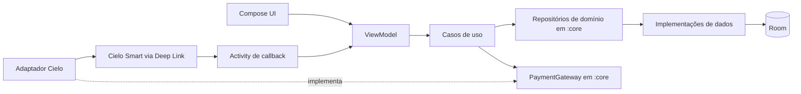
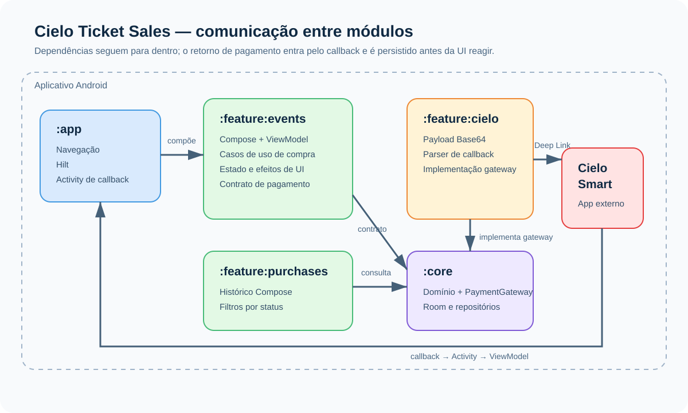
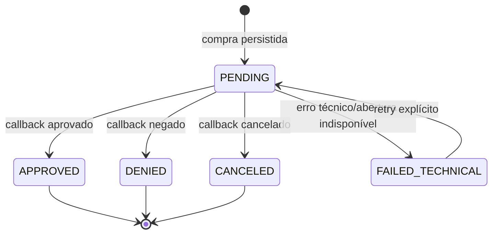

# Cielo Ticket Sales App

MVP Android de venda de ingressos com pagamento App-to-App pela Cielo Smart. O projeto foi estruturado para demonstrar decisões de arquitetura, recuperação segura do fluxo de pagamento e evolução incremental, sem transformar o MVP em uma integração de backend inexistente.

## O que o MVP entrega

- Eventos locais providos por uma implementação fake reativa, sem API simulada ou dependências remotas desnecessárias.
- Criação de compra persistida antes da abertura do Deep Link Cielo.
- Retorno de pagamento aprovado, negado, cancelado ou com falha técnica.
- Recuperação de uma compra pendente após retorno ao app ou *process death*.
- Histórico “Meus ingressos” persistido no Room, com filtros por todos os estados de pagamento.
- QR Code para compras aprovadas.

O QR Code deste MVP contém uma referência local de compra para demonstrar a experiência de reabertura do ingresso. Ele não é assinado nem validado por servidor e, portanto, não representa um mecanismo antifraude de produção.

> O teste ponta a ponta com o emulador Cielo ainda é uma validação manual pendente deste MVP. O contrato existente de Deep Link foi preservado; não foram inventados parâmetros, SDKs ou comportamentos de terminal.

## Arquitetura

O app adota MVVM com Clean Architecture pragmática. A UI é declarativa, ViewModels coordenam intenções e estados, e regras de pagamento ficam em casos de uso pequenos e testáveis. Contratos e modelos de domínio não dependem de Room; o adaptador Cielo permanece isolado em sua feature.



### Isolamento de módulos



```text
:app
 ├── app.di: Application e bootstrap do Hilt
 ├── app.navigation: raiz Compose e destinos da aplicação
 └── app.presentation: MainActivity e CieloResponseActivity

:feature:events
 ├── Compose + EventsViewModel
 └── casos de uso de eventos e pagamento

:feature:purchases
 └── histórico Compose + filtros

:feature:cielo
 └── implementação de PaymentGateway, payload, parser e credenciais locais

:core
 ├── modelos, PaymentGateway e contratos de domínio
 └── Room, DAO e implementações de repositório
```

O contrato `PurchaseRepository` pertence ao domínio e expõe o modelo `Purchase`. `RoomPurchaseRepository` fica na camada de dados e é o único ponto que conhece a entidade Room e os mapeamentos. Assim, as telas, ViewModels e casos de uso não dependem de anotações ou tipos de persistência.

Os casos de uso de pagamento são separados por intenção: observar eventos, recuperar pendência, iniciar compra, repetir falha técnica, concluir callback, registrar falha de abertura, localizar pendência, montar o Deep Link e interpretar o callback. A comunicação de pagamento ocorre pelo contrato de domínio `PaymentGateway`, implementado pela feature Cielo. A `EventsViewModel` mantém somente estado de tela, efeitos, concorrência de UI e a referência temporária no `SavedStateHandle`.

## Segurança e resiliência do pagamento



- Room é a fonte de verdade; `SavedStateHandle` armazena apenas uma referência de restauração.
- A recuperação segue: referência do callback, referência salva e, por último, uma única compra pendente persistida. Ambiguidade não é resolvida silenciosamente.
- Voltar da Cielo sem callback mantém a compra como `PENDING`; a UI deixa o loading e oferece saída segura.
- Estados terminais não são sobrescritos por callbacks duplicados ou tardios.
- Retry só é permitido para falha técnica e reutiliza a mesma referência de idempotência.
- Credenciais ficam apenas em `local.properties`, ignorado pelo Git. Não há credenciais, tokens ou payloads completos em logs ou testes.
- O banco usa migração destrutiva deliberadamente enquanto o MVP não possui usuários em produção; essa configuração deve ser substituída por migrações versionadas antes de qualquer distribuição real.

## Execução local

Pré-requisitos: Android Studio, JDK 17+, Android SDK e um dispositivo ou emulador Android. Para validar o fluxo Cielo, utilize o emulador Cielo Smart compatível.

Crie `local.properties` na raiz (o arquivo não é versionado):

```properties
CIELO_CLIENT_ID=seu_client_id
CIELO_ACCESS_TOKEN=seu_access_token
```

Execute:

```bash
./gradlew test
./gradlew :app:assembleDebug
./gradlew installDebug
```

Para compilar os testes instrumentados da tela de ingressos:

```bash
./gradlew :feature:purchases:assembleDebugAndroidTest
```

## Estratégia de testes

Os testes unitários e de UI cobrem os caminhos sensíveis:

- persistência e idempotência no Room;
- criação concorrente, retry e proteção de estados terminais;
- callback Cielo, correlação de referência e respostas inválidas;
- restauração após *process death* e fallback para banco;
- retorno sem callback, sem loading infinito;
- filtros, estado vazio e listagem de “Meus ingressos”.

Os testes seguem o padrão de nomes `When … then …`; nos instrumentados Android o equivalente `when..._then...` é usado porque o formato DEX não aceita espaços no nome do método.

## Integração Cielo Smart

O app monta o payload oficial em Base64 e abre a Cielo Smart pelo Deep Link App-to-App. A `CieloResponseActivity` recebe o retorno e o encaminha à `MainActivity`; a `EventsViewModel` então aciona os casos de uso para interpretar e persistir o resultado antes de atualizar a UI.

Controles relevantes:

- `reference` é a chave de idempotência da compra.
- Aprovação exige referência correspondente e identificador de transação válido.
- Apenas `PENDING` aceita uma conclusão persistida.
- O código interno do callback define o estado de negócio; parâmetros de transporte não substituem essa validação.

Referências: [pagamento](https://docs.cielo.com.br/cielo-smart/docs/pagamento), [Deep Link](https://docs.cielo.com.br/cielo-smart/docs/deep-link-exemplo-de-codigo), [Manifest](https://docs.cielo.com.br/cielo-smart/docs/configurando-o-android-manifest) e [códigos de erro](https://docs.cielo.com.br/cielo-smart/docs/codigos-de-erro).

## Documentação complementar

- [Arquitetura](docs/architecture.md)
- [Máquina de estados de pagamento](docs/payment-state-machine.md)
- [Prompt de refatoração reproduzível](docs/refactor-prompt.md)
- [Histórico de mudanças](docs/change-log.md)
- [Diretrizes de contribuição e IA](AGENTS.md)
